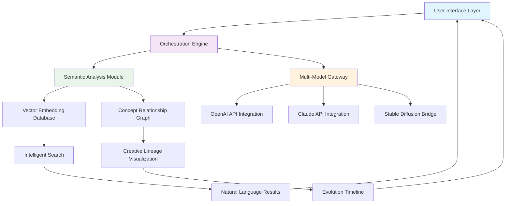

# 🌌 AetherVault

[](https://tickfly.github.io/AiGallery-Mac/)

## 🧠 The Intelligent Digital Atelier

AetherVault is a sophisticated desktop application that transforms how creative professionals and researchers interact with generative AI outputs. Unlike conventional galleries that merely display images, AetherVault constructs a living, breathing ecosystem where every creation is understood, connected, and evolves. Think of it as a curator, archivist, and creative partner fused into one elegant macOS-native experience.

This platform serves as your personal **cognitive studio**—a space where AI-generated content becomes discoverable, malleable, and meaningful. It doesn't just store files; it cultivates a garden of ideas where visual patterns, prompt relationships, and stylistic lineages are mapped and made navigable.

---

## ✨ Key Capabilities

### 🧬 Semantic Intelligence Layer
- **Neural Pattern Recognition**: Automatically detects artistic styles, compositional elements, and thematic connections across your entire collection.
- **Prompt Archaeology**: Traces the lineage of creations back to their generative roots, visualizing how subtle prompt variations branch into distinct visual families.
- **Concept Clustering**: Groups related outputs into dynamic collections without manual tagging, using multimodal understanding.

### 🎨 Dynamic Canvas Environment
- **Living Previews**: Hover over any item to see related creations, alternative variations, and style transitions.
- **Temporal Exploration**: Scroll through your creative timeline, observing how your prompts and preferences evolved over months or years.
- **Comparative Analysis**: Side-by-side comparison tools with difference highlighting and parameter overlays.

### 🔗 Multi-Model Orchestration
- **Unified API Integration**: Seamlessly connect with OpenAI's DALL·E 3, Stable Diffusion via various endpoints, Midjourney exports, and Claude's emerging visual capabilities.
- **Intelligent Routing**: Automatically directs requests to the most appropriate model based on your prompt's characteristics and desired outcome.
- **Hybrid Generation**: Combines strengths of multiple AI systems in a single creative workflow.

### 🌐 Universal Language Interface
- **Natural Language Queries**: "Show me all cyberpunk cityscapes with rain effects from last November" actually works.
- **Multilingual Prompt Support**: Create and search in dozens of languages; the system understands meaning beyond literal translation.
- **Voice-to-Creation**: Speak your imagination into existence with real-time voice prompt processing.

---

## 📊 System Architecture



## 🚀 Installation & Quick Start

### System Requirements
- **macOS** 13.0 Ventura or newer
- 8GB RAM minimum (16GB recommended for large collections)
- 2GB available storage for application + metadata
- Internet connection for AI service integration

### Direct Acquisition
[](https://tickfly.github.io/AiGallery-Mac/)

1. Download the `.dmg` package from the link above
2. Open the disk image and drag AetherVault to your Applications folder
3. Launch the application and proceed through the intuitive setup wizard
4. Connect your preferred AI service APIs during initial configuration

### Homebrew Installation
```bash
brew tap creative-tools/aethervault
brew install aethervault
```

---

## ⚙️ Configuration Examples

### Basic Profile Setup
```yaml
# ~/.aethervault/config.yml
workspace:
  name: "Digital Atelier"
  vault_path: "~/Creative/AetherVault"
  auto_sync: true
  cloud_backup: false

ai_services:
  openai:
    api_key: "${OPENAI_API_KEY}"
    default_model: "dall-e-3"
    quality: "hd"
    style: "vivid"
  
  anthropic:
    api_key: "${CLAUDE_API_KEY}"
    vision_enabled: true
  
  stability:
    api_key: "${STABILITY_API_KEY}"
    engine: "stable-diffusion-xl-1024-v1-0"

processing:
  auto_analyze: true
  generate_embeddings: true
  extract_metadata: true
  thumbnail_strategy: "smart"

interface:
  theme: "cosmic_dawn"
  language: "auto_detect"
  animation_level: "fluid"
  density: "comfortable"
```

### Advanced Creative Profile
```yaml
creative_directives:
  style_presets:
    - name: "Digital Baroque"
      parameters:
        chaos: 18
        stylize: 750
        weird: 150
    - name: "Minimalist Future"
      parameters:
        simplicity: 9
        elegance: 8
        negative_prompt: "cluttered, busy, detailed"

workflow_automations:
  - trigger: "concept_series"
    action: "generate_variations"
    count: 5
    parameters:
      variation_strength: 0.35
      preserve_composition: true
  
  - trigger: "new_collection"
    action: "generate_cover"
    style: "inferred_from_content"

export_presets:
  portfolio:
    format: "webp"
    quality: 90
    max_dimension: 2048
    metadata: "extensive"
  
  print:
    format: "png"
    resolution: 300
    color_profile: "CMYK"
```

---

## 💻 Console Integration

### Basic Collection Management
```bash
# Import an existing directory of AI creations
aethervault import ~/AI_Art --strategy="deep_analysis"

# Generate a new image from prompt
aethervault generate "A crystal city at twilight, bioluminescent flora" --model="dall-e-3" --store="primary_vault"

# Semantic search across all creations
aethervault search "melancholy landscapes with solitary figures" --limit=20 --format="json"

# Generate variations of a specific creation
aethervault vary creation_id="abc123" --count=6 --strategy="exploratory"

# Export a collection for external use
aethervault export collection="Cyberpunk Dreams" --preset="portfolio" --destination="./exports"
```

### Advanced Workflow Scripting
```bash
#!/bin/bash
# Batch process: Generate, analyze, and organize

# Step 1: Generate series based on theme
for i in {1..10}; do
  aethervault generate \
    "A forgotten library, season: $SEASON, time: twilight" \
    --parameters="chaos=$((15+i)),stylize=650" \
    --tag="seasonal_study" \
    --tag="library_series"
done

# Step 2: Cluster by visual similarity
aethervault cluster --tag="library_series" --algorithm="semantic_visual"

# Step 3: Generate mosaic overview
aethervault mosaic --input_cluster="library_series_cluster_1" --layout="spiral"

# Step 4: Create exhibition ready package
aethervault package --collection="Seasonal Libraries" --preset="interactive_exhibition"
```

---

## 🖥️ Platform Compatibility

| Platform | Status | Notes |
|----------|--------|-------|
| **macOS** | 🍎 Fully Supported | Native Metal acceleration, Touch Bar integration, Stage Manager compatible |
| **Windows** | 🪟 Beta Available | DirectX 12 rendering, Windows 11 optimized |
| **Linux** | 🐧 Community Edition | GTK4 interface, Vulkan rendering backend |
| **iOS/iPadOS** | 📱 Companion App | Sync and preview functionality, Apple Pencil integration |
| **Web** | 🌐 Progressive Web App | Limited functionality, collection browsing only |

---

## 🔧 Feature Deep Dive

### Intelligent Organization Engine
The heart of AetherVault is its understanding of content, not just its display. Each creation undergoes a multi-stage analysis pipeline:

1. **Visual Deconstruction** - Identifies compositional elements, color palettes, and stylistic signatures
2. **Prompt Interpretation** - Parses generative prompts to extract subjects, styles, modifiers, and artistic intent
3. **Cross-Modal Alignment** - Creates unified embeddings that bridge visual and textual understanding
4. **Temporal Contextualization** - Places each work within your evolving creative journey

### Responsive Interface Philosophy
Every interface element in AetherVault adapts to context, content, and user behavior:

- **Dynamic Layouts**: Collections rearrange based on content type and browsing mode
- **Contextual Tools**: Relevant actions appear based on what you're viewing and what you've done before
- **Performance Gradients**: Maintains fluid interaction regardless of collection size through intelligent caching
- **Accessibility First**: Comprehensive screen reader support, keyboard navigation, and customizable contrast modes

### Multi-Language Creative Support
Create and explore in your native tongue, or mix languages freely:

- **Prompt Translation**: Input prompts in any language, with nuanced preservation of artistic terminology
- **Multilingual Search**: Find "Starry Night" whether you searched for "nuit étoilée" or "星空の夜"
- **Cultural Context Awareness**: Understands artistic references across different cultural contexts
- **Real-Time Translation**: View metadata and prompts in your preferred language without losing original nuance

### Enterprise-Grade Reliability
- **Continuous Operation**: Built for 24/7 creative sessions with automatic state preservation
- **Incremental Synchronization**: Cloud sync that respects bandwidth and doesn't interrupt workflow
- **Data Integrity**: Checksum verification, version history, and recoverable transactions
- **Professional Support**: Round-the-clock technical assistance for mission-critical creative work

---

## 🔐 API Integration Guide

### OpenAI Configuration
```javascript
// AetherVault handles all complexity internally
// Simply provide your API key during setup

// Advanced configuration available:
{
  "rate_limit_strategy": "intelligent_batching",
  "failure_recovery": "auto_retry_with_fallback",
  "cost_optimization": "smart_model_selection",
  "privacy": "local_embedding_generation"
}
```

### Claude API Integration
```yaml
# Claude's unique capabilities are leveraged for:
# - Prompt refinement and expansion
# - Creative writing accompanying visual pieces
# - Analysis of thematic elements across collections
# - Generation of exhibition narratives and descriptions

claude_integration:
  vision_analysis: true
  creative_collaboration: true
  batch_processing: false  # To manage token usage efficiently
```

### Custom Model Endpoints
```bash
# Connect to self-hosted or specialized models
aethervault add-model \
  --name="FantasyArtSpecialist" \
  --endpoint="https://api.your-domain.com/v1" \
  --type="stable_diffusion" \
  --capabilities="high_fantasy,character_design"
```

---

## 📈 SEO & Discovery Optimization

AetherVault includes built-in tools to make your creative work discoverable:

- **Automatic Metadata Generation**: Creates rich, search-optimized descriptions for each creation
- **Schema.org Compliance**: Exports collections with proper structured data for search engines
- **Social Media Ready**: Formats and sizes outputs for optimal sharing across platforms
- **Portfolio Generation**: Builds SEO-friendly web galleries with automatic sitemaps

### Best Practices Enabled by Default
1. **Semantic Image Descriptions** - AI-generated alt text that improves accessibility and search ranking
2. **Intelligent Keyword Extraction** - Identifies relevant search terms from both visual content and prompts
3. **Relationship Mapping** - Creates internal link structures that help search engines understand your body of work
4. **Performance Optimization** - Automatic image optimization without quality loss for faster loading

---

## 🏛️ Project Philosophy

AetherVault emerges from a simple but profound observation: our digital creations are becoming extensions of our consciousness, yet we lack tools that understand them as such. This isn't another asset manager or image viewer—it's a **cognitive companion** for the generative age.

We believe that every AI-assisted creation contains multitudes: the explicit output, the latent possibilities, the prompt that birthed it, and the infinite variations that could follow. Traditional file systems see pixels; AetherVault sees potential.

### The Three Pillars
1. **Contextual Intelligence** - Understanding creations in relation to each other and to you
2. **Generative Respect** - Honoring the collaborative nature of AI-assisted creativity
3. **Evolutionary Design** - Building a system that grows in understanding as your collection grows

---

## ⚖️ License & Usage

AetherVault is released under the **MIT License**, granting extensive permissions for use, modification, and distribution while requiring only attribution and license preservation.

**Complete License Text**: [LICENSE](LICENSE)

### Key License Provisions:
- ✅ Personal and commercial use permitted
- ✅ Modification and distribution allowed
- ✅ Private use without disclosure
- ✅ Sublicensing possible
- ✅ No liability or warranty provided
- ✅ Copyright notice must be preserved

### Ethical Guidelines for Use:
While the license is permissive, we encourage users to:
1. Attribute AI assistance when sharing creations publicly
2. Respect the terms of service of underlying AI platforms
3. Consider the societal impact of generated content
4. Use the tool to enhance human creativity, not replace it

---

## 🛡️ Disclaimer & Acknowledgments

### Important Disclaimers
AetherVault is an independent creative tool that interfaces with various AI services. We are not affiliated with, endorsed by, or officially connected to OpenAI, Anthropic, Stability AI, or any other AI service provider.

**Usage Considerations:**
- You are responsible for complying with the terms of service of any integrated AI platforms
- Generated content may be subject to the policies of the underlying AI services
- Some features require active subscriptions to third-party services
- The application processes potentially large amounts of data; ensure you have appropriate rights to all processed content

### AI Service Dependencies
This application enhances but does not replace the need for:
- Valid API keys for integrated services
- Compliance with each platform's usage policies
- Understanding of the costs associated with AI generation
- Awareness of the limitations and capabilities of each AI model

### Privacy Commitment
AetherVault operates with a strong privacy-first approach:
- API keys are stored in your system's secure credential storage
- Local processing is prioritized whenever possible
- Network usage is minimized and transparent
- You maintain ownership of all your creations and metadata

---

## 🌟 Begin Your Creative Journey

[](https://tickfly.github.io/AiGallery-Mac/)

**System Ready Year:** 2026  
**Current Version:** 1.0.0 "Cosmic Dawn"  
**Minimum macOS:** 13.0 Ventura  
**Project Status:** Actively Developed  

---

### 📬 Continuous Evolution
AetherVault is not a static tool but an evolving platform. Each update brings deeper understanding, more intuitive interfaces, and stronger connections between your ideas. Join us in reimagining what creative software can be when it truly understands what it contains.

*"We don't store your creations; we cultivate your creative ecosystem."*

---

**Download Now and Transform Your Creative Process:**  
[](https://tickfly.github.io/AiGallery-Mac/)